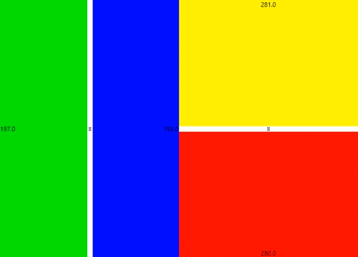

<h1 align="center">Compose Split Screen</h1>

<div align="center" style="display: grid; justify-content: center;">

|                                                                  🌟                                                                   |                  Support this project                   |               
|:-------------------------------------------------------------------------------------------------------------------------------------:|:-------------------------------------------------------:|
|    | <code>bc1qs6qq0fkqqhp4whwq8u8zc5egprakvqxewr5pmx</code> | 
|  | <code>0x3147bEE3179Df0f6a0852044BFe3C59086072e12</code> |
|     |     <code>TKznmR65yhPt5qmYCML4tNSWFeeUkgYSEV</code>     |

</div>

<br>

<p align="center">This is a container component that allows you to split content into two child components, dynamically changing the size of each of them depending on the slider position. It can be horizontal or vertical, and also allows you to specify the nitial, minimum and maximum slider position</p>

<br>

<p align="center"></p>

## Installation

```
repositories {
    maven("https://jitpack.io")
}

dependencies {
    implementation("com.github.numq:compose-split-screen:1.0.1")
}
```
